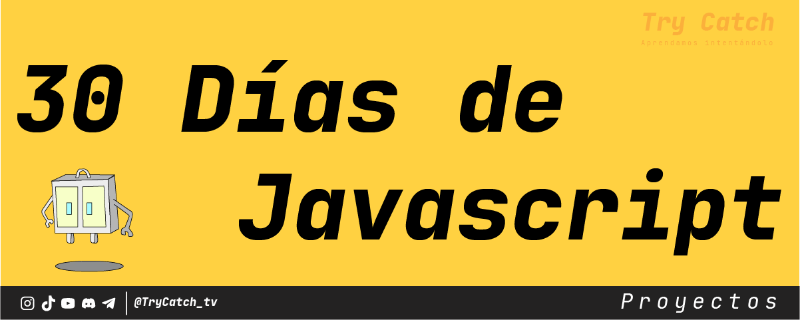

# 30 días de proyectos en Javascript

La idea de este proyecto es facilitar una vía para que puedan practicar con ejercicios sencillos; no hace falta tener conocimientos avanzados para participar, esta metodología busca incentivar el crecimiento de conocimiento mediante la búsqueda de lo requerido para completar cada reto.

## Día 1: To-Do List App
Crea una aplicación para crear y gestionar una lista de tareas pendientes. Los usuarios podrán agregar, marcar como completadas y eliminar tareas de la lista.

Referencias:
- Tutorial: [How to build a simple ToDo App with JavaScript](https://freshman.tech/todo-list/)
- GitHub Repo: [Simple ToDo List App](https://github.com/themaxsandelin/todo)

¡Buena suerte con tus proyectos y happy coding!

## Día 2: Weather App
Crea una aplicación del tiempo que muestre el clima actual y el pronóstico de los próximos días para una ubicación específica. La aplicación debe obtener información del clima utilizando una API, como la de OpenWeatherMap.

Referencias:
- Tutorial: [How to build a Weather App with JavaScript](https://www.youtube.com/watch?v=wPElVpR1rwA)

## Día 3: Calculator Web App
Crea una aplicación de calculadora que permita a los usuarios realizar operaciones matemáticas básicas como suma, resta, multiplicación y división.

Referencias:
- Tutorial: [How to build a calculator with JavaScript](https://www.freecodecamp.org/news/how-to-build-an-html-calculator-app-from-scratch-using-javascript-4454b8714b98/)
- GitHub Repo: [Calculator Web App](https://github.com/zellwk/javascript-calculator)

## Día 4: Countdown Timer
Crea un temporizador de cuenta atrás que permita a los usuarios ingresar una fecha y hora específicas, y muestre cuánto tiempo falta para llegar a esa fecha.

Referencias:
- Tutorial: [How to create a countdown timer with JavaScript](https://www.w3schools.com/howto/howto_js_countdown.asp)

## Día 5: Random Quote Generator
Crea una aplicación que muestre una cita aleatoria cada vez que el usuario presione un botón.

Referencias:
- Tutorial: [How to build a Random Quote Generator with JavaScript](https://freshman.tech/random-quote-machine/)

## Día 6: Trivia Quiz App
Crea una aplicación de trivia que presente a los usuarios preguntas de opción múltiple y proporcione retroalimentación sobre si la respuesta seleccionada es correcta o incorrecta.

Referencias:
- Tutorial: [How to build a Pomodoro Timer with JavaScript](https://www.youtube.com/watch?v=9EVmiQCfkuQ)

## Día 7: Conversor de divisas vía API
Crea una aplicación que permita a los usuarios convertir una cantidad en una moneda a otra moneda utilizando tasas de cambio en tiempo real.

Referencias:
- Tutorial: [How to build a currency converter with JavaScript](https://docs.hektorprofe.net/academia/javascript/conversor-divisas/)

## Día 8: Pomodoro Timer
Crea un temporizador Pomodoro que permita a los usuarios establecer períodos de trabajo y descanso para mejorar la productividad.

Referencias:
- Tutorial: [How to build a Pomodoro Timer App with JavaScript](https://freshman.tech/pomodoro-timer/)
- Demo: [Link](https://freshman-pomodoro.surge.sh/)
- GitHub Repo: [Pomodoro starter files](https://github.com/Freshman-tech/pomodoro-starter-files)

## Día 9: Tic-Tac-Toe Game
Crea un juego de Tic-Tac-Toe (3 en raya) que permita a dos jugadores competir en el mismo dispositivo o navegador.

Referencias:
- Tutorial: [Simple Tic-Tac-Toe JavaScript game for beginners](https://www.codebrainer.com/blog/tic-tac-toe-javascript-game)

## Día 10: Simple Drawing App
Crea una aplicación de dibujo que permita a los usuarios dibujar en un lienzo usando el mouse o la pantalla táctil.

Referencias:
- Tutorial: [How to build a simple drawing app with JavaScript](https://www.youtube.com/watch?v=3GqUM4mEYKA)
- GitHub Repo: [Simple Drawing App](https://github.com/wesbos/JavaScript30/tree/master/08%20-%20Fun%20with%20HTML5%20Canvas)

## Día 11: Image Slider
Crea un deslizador de imágenes que permita a los usuarios navegar a través de una colección de imágenes.

Referencias:
- Tutorial: [How to create an image slider with JavaScript](https://www.w3schools.com/howto/howto_js_slideshow.asp)

## Día 12: Expense Tracker
Crea una aplicación para realizar un seguimiento de los gastos e ingresos de los usuarios.

Referencias:
- Tutorial: [How to build an expense tracker with JavaScript](https://www.youtube.com/watch?v=XuFDcZABiDQ)
- GitHub Repo: [Expense Tracker](https://github.com/bradtraversy/expense-tracker-react)

## Día 13: Hangman Game
Crea un juego de ahorcado en el que los usuarios intenten adivinar una palabra al seleccionar letras individuales.

Referencias:
- Tutorial: [How to build a Hangman game with JavaScript](https://www.youtube.com/watch?v=i6eP1Lw4gZk)
- GitHub Repo: [Hangman Game](https://github.com/bradtraversy/vanillawebprojects/tree/master/hangman)

## Día 14: Basic Blog Website
Crea un sitio web de blog básico que muestre publicaciones de blog y permita a los usuarios agregar, editar y eliminar publicaciones.

Referencias:
- Tutorial: [How to build a basic blog website with JavaScript](https://zellwk.com/blog/crud-express-mongodb/)

## Día 15: Password Generator
Crea una aplicación que genere contraseñas seguras y aleatorias basadas en criterios seleccionados por el usuario, como la longitud y los tipos de caracteres.

Referencias:
- Tutorial: [How to build a password generator with JavaScript](https://www.youtube.com/watch?v=duNmhKgtcsI)

## Día 16: Music Player
Crea un reproductor de música que permita a los usuarios reproducir, pausar, adelantar y retroceder canciones, así como ajustar el volumen.

Referencias:
- Tutorial: [How to build a music player with JavaScript](https://www.youtube.com/watch?v=QTHRWGn_sJw)
- GitHub Repo: [Music Player](https://github.com/bradtraversy/vanillawebprojects/tree/master/music-player)

## Día 17: Analog Clock
Crea un reloj analógico que muestre la hora actual utilizando las agujas de las horas, minutos y segundos.

Referencias:
- Tutorial: [How to build an analog clock with JavaScript](https://www.youtube.com/watch?v=94TKO4eKfIA)
- GitHub Repo: [Analog Clock](https://github.com/bradtraversy/vanillawebprojects/tree/master/custom-video-player)

## Día 18: Movie Search App
Crea una aplicación de búsqueda de películas que permita a los usuarios buscar películas por título y mostrar información detallada sobre la película seleccionada.

Referencias:
- Tutorial: [How to build a movie search app with JavaScript](https://www.taniarascia.com/how-to-connect-to-an-api-with-javascript/)
- GitHub Repo: [Movie Search App](https://github.com/taniarascia/sandbox/tree/master/ghibli)

## Día 19: Memory Game
Crea un juego de memoria en el que los usuarios intenten encontrar pares de cartas que coincidan al voltearlas.

Referencias:
- Tutorial: [How to build a memory game with JavaScript](https://marina-ferreira.github.io/tutorials/js/memory-game/)
- GitHub Repo: [Memory Game](https://github.com/code-sketch/memory-game)

## Día 20: Simple Chat App
Crea una aplicación de chat simple que permita a los usuarios enviar y recibir mensajes en tiempo real.

Referencias:
- Tutorial: [How To Build A JavaScript Chat App](https://www.cometchat.com/tutorials/how-to-build-a-javascript-chat-app)
- GitHub Repo: [Simple Chat App](https://github.com/cometchat-pro-tutorials/javascript-chat-app)

## Día 21: News App
Crea una aplicación de noticias que muestre las últimas noticias de diferentes fuentes utilizando una API de noticias.

Referencias:
- Tutorial: Create News App using HTML, CSS & JavaScript | News App with Different News Categories](https://www.youtube.com/watch?v=Q5l1kAIcOag&ab_channel=Codingflag)

## Día 22: Text Editor
Crea un editor de texto simple que permita a los usuarios escribir, editar y guardar texto.

Referencias:
- Tutorial: [How to create Text Editor using Javascript and HTML ?](https://www.geeksforgeeks.org/how-to-create-text-editor-using-javascript-and-html-dom/)

## Día 23: Calculator Web App (Scientific)
Crea una aplicación de calculadora científica que permita a los usuarios realizar operaciones matemáticas avanzadas, como trigonometría, logaritmos y potencias.

Referencias:
- Tutorial: [How to build a scientific calculator with JavaScript](https://www.youtube.com/watch?v=j59qQ7YWLxw)
- GitHub Repo: [Scientific Calculator](https://github.com/WebDevSimplified/Vanilla-JavaScript-Calculator)

## Día 24: Recipe App
Crea una aplicación de recetas que permita a los usuarios buscar, ver, agregar, editar y eliminar recetas.

Referencias:
- Tutorial: [Recipe App With Javascript](https://codingartistweb.com/2022/05/recipe-app-with-javascript/)

## Día 25: Job Search App
Crea una aplicación de búsqueda de empleo que permita a los usuarios buscar empleos por palabra clave y ubicación utilizando una API de búsqueda de empleo.

Referencias:
- Tutorial: [How To Build a Job Search App (Node, APIs, Vanilla JS)](https://youtu.be/v7cprTuAnlA)
- GitHub Repo: [Job Search App](https://github.com/codebubb/job-search-app)

## Día 26: Markdown Previewer
Crea una aplicación que permita a los usuarios escribir texto en formato Markdown y ver una vista previa del texto en HTML.

Referencias:
- Tutorial: [Build a Markdown Previewer](https://medium.com/@benjaminadk/build-a-markdown-previewer-96af2622dd9a)

## Día 27: URL Shortener
Crea una aplicación que permita a los usuarios acortar URLs largas a versiones más cortas y fácilmente compartibles.

Referencias:
- Tutorial: [How to Create a URL Shortener Using Javascript](https://www.section.io/engineering-education/how-to-create-a-url-shortener-with-javascript/)
- GitHub Repo: [URL Shortener](https://github.com/JudyNduati/How-to-create-a-URL-shortener-with-Javascript-)

## Día 28: E-commerce Shopping Cart
Crea un carrito de compras de comercio electrónico que permita a los usuarios agregar y eliminar productos del carrito y calcular el total de la compra.

Referencias:
- Tutorial: [E-Commerce JavaScript Tutorial - Shopping Cart from Scratch](https://youtu.be/023Psne_-_4)

## Día 29: Weather Dashboard
Crea un panel de control del tiempo que muestre el pronóstico del tiempo actual y extendido para múltiples ubicaciones.

Referencias:
- Tutorial: [Build a Simple Weather App With Vanilla JavaScript](https://webdesign.tutsplus.com/tutorials/build-a-simple-weather-app-with-vanilla-javascript--cms-33893)

## Día 30: Portfolio Website
Crea un sitio web de portafolio personal que muestre tus proyectos, habilidades y experiencia laboral, y permita a los visitantes ponerse en contacto contigo.

Referencias:
- Tutorial: [How to Build Your Own Developer Portfolio Website with HTML, CSS, and JavaScript](https://www.freecodecamp.org/news/how-to-build-a-developer-portfolio-website/)

¡Buena suerte con tus proyectos y happy coding!

## Contacto

[@TryCatch.tv](https://www.tiktok.com/@trycatch.tv)

[Linktr.ee](https://linktr.ee/trycatch.tv)
